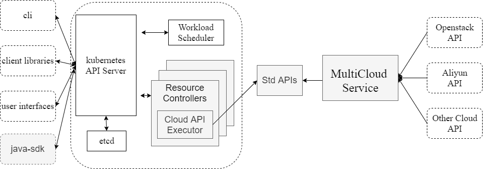
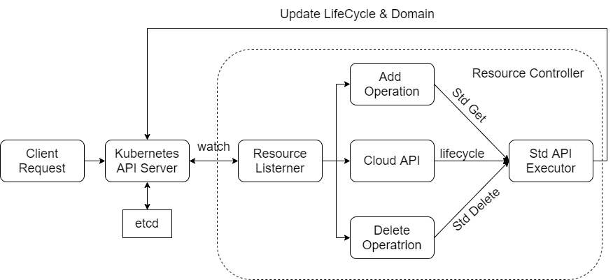

## What is cloudctl?
This project aims to take control of different cloud resources with kubernetes operator. By defining the CRD(CustomResourceDefinition) of the cloud resource, it's easy to execute the underlying cloud providers' API and get the status of the cloud resource. 

This project will call the cloud Std-API generated by [multicloud_service](https://github.com/kube-stack/multicloud_service). Instead of using the official client-go offered by kubernetes, we use our own [client-go](https://github.com/kubesys/client-go) package to interact with kubernetes cluster. We also provide user with a java client, [java_sdk](https://github.com/kube-stack/java-sdk), which can be used to manage different cloud resources.

## Design
The figure below shows the full design of our project. This repository implement the `Resource Controller` part of the project. As shown in the figure, it watches the CRD from kubernetes api server. Once there is an update of one CRD's _liefcycle_, it will call the cloud std API provided by `multicloud_service` and save the response as an Event. 



## Process
The following figure shows the work flow of this project. 
1. `API server` accepts one client request on CRD, and update infomarion saved in etcd.
2. `API server` notice `Resource Listener` which is watching the CRD that there is a change in one CRD resource. 
3. Based on the _lifecycle_ of the CRD, `Resource Controller` will call the corresponding Std API, and save the response in an `event`.
4. `Resource Controller` will call a `Get` API automatically after executing the _lifecycle_, and then update the _domain_ based on the response.
5. If the _lifecycle_ is a `delete` API, the `Resource Controller` will also delete the CRD Resource from kubernetes cluster. Similarly, if user only delete the CRD Resource, `Resource Controller` will also call the `delete` API to delete cloud resource. (To avoid this happening, just stop cloudctl running) 



## Usage
### define CRD
1.  _lifecycle_ is an object type and is used to save the cloud API json file.
2.  _domain_ is used to save underlying cloud resource metadata. 
3. Users need to add some metadata of the cloud resouce, like UUID, which is used to find the specfic resource. 
4. Users need to define a secret which contains the authentication information. And the _secretRef_ contains the secret's name and namespace.
```yaml
apiVersion: apiextensions.k8s.io/v1
kind: CustomResourceDefinition
metadata:
  name: openstackservers.doslab.io
spec:
  group: doslab.io
  names:
    kind: OpenstackServer
    plural: openstackservers
    singular: openstackserver
  scope: Namespaced
  versions:
    - additionalPrinterColumns:
        - description: Server ID
          jsonPath: .spec.id
          name: ID
          type: string
        - description: Server Name
          jsonPath: .spec.domain.name
          name: Name
          type: string
        - description: Server Status
          jsonPath: .spec.domain.status
          name: Status
          type: string
        - description: host id is where the server is located in the cloud
          jsonPath: .spec.domain.hostid
          name: HostID
          type: string
        - description: image
          jsonPath: .spec.domain.image.id
          name: ImageID
          type: string
        - description: flavor
          jsonPath: .spec.domain.flavor.id
          name: FlavorID
          type: string
      name: v1
      schema:
        openAPIV3Schema:
          description: VMInstance is the Schema for the vminstances API
          properties:
            apiVersion:
              type: string
            kind:
              type: string
            metadata:
              type: object
            spec:
              description: spec defines the desired state of openstack server
              properties:
                domain:
                  type: object
                  x-kubernetes-preserve-unknown-fields: true
                lifeCycle:
                  description: request to be execute
                  type: object
                  x-kubernetes-preserve-unknown-fields: true
                #                  metadata
                id:
                  type: string
                #                  secret info requeired
                secretRef:
                  description: SrereteRef
                  properties:
                    name:
                      description: secretName
                      type: string
                    namespace:
                      description: secretNamespace
                      type: string
                  required:
                    - name
                    - namespace
                  type: object
              required:
                - secretRef
              type: object
            status:
              type: object
          type: object
      served: true
      storage: true
      subresources:
        status: {}

```

### define CRD config 
In order to take control of the CRD, user need to offer a config file to `cloudctl`.
    
1. `CrdName` is the name in CustomResourceDefinition. 
2. `InitJson` contains the `Get` operation of the Std-API. `ResourceController` call this to get the detailed infomation the cloud resource. The parameters required should be listed in the json as key-value, key is the name and value is empty string. When `ResourceController` try to execute the 'InitJson', it will fill the value based on the 'MetaInfos'.
3. `DeleteJson` contains the `delete` operation of the Std-API. `ResourceController` will execute it when user try to delete the CRD in kubernetes.
2. Some metadata(which is required by std-API) of the CRD have different name and json path in different files. So we use `MetaInfos` to keep those information, take `id` as example
   1. `SpecName` means the metadata's name define in CRD _spec_, which is 'id' in this case.
   2.  `DomainName` means the metadata's name define in CRD _domin_, which is 'id' in this case.
   3. `CloudParaName` describe the metadata's name in std-API request(like GetComputeV2Servers...), which is 'id' in this case.
   4. `InitJsonPath` describe the variable `id` json path in `InitJson`.
   5. When the `ResourceController` called the request in `InitJson`, it can get the detailed infomation of the cloud resource in the response. And `InitRespJsonPath` is used to parse that information and saved in the _domain_.
   6. `IsArray` describes whether the 'Get' operation takes a list as input(like a list of server ids to get all the servers information).   
```json
{
  "CrdName": "OpenstackServer",
  "MetaInfos": [
    {
      "SpecName": "id", 
      "DomainName": "id", 
      "CloudParaName":"id", 
      "InitJsonPath": "GetComputeV2Servers.id", 
      "DeleteJsonPath": "DeleteComputeV2Servers.id",
      "InitRespJsonPath": "server.id", 
      "IsArray": false 
    }
  ],
  "InitJson": { 
    "GetComputeV2Servers": {
      "id": ""
    }
  },
  "DeleteJson": { 
    "DeleteComputeV2Servers": {
      "id": ""
    }
  },
  "DomainJsonPath":"server" 
}
```

User can deploy this project by makefile.

### deploy the cloudctl in your kubernetes cluster
```shell
make deploy
```

### undeploy the cloudctl in your kubernetes cluster
```shell
make undeploy
```

### add CRD to kubernets cluster
```shell
make install
```

### delete CRD
```shell
make uninstall
```

### Execute Cloud API
The json below is used to Create a Openstack Server. The response will contains the server's UUID and 
will be filled in the _spec.id_. The controller will automatically execute the GET Request from 
the config's InitJson, and fill the _domain_ with the response.
```json
{
  "apiVersion": "doslab.io/v1",
  "kind": "OpenstackServer",
  "metadata": {
    "name": "openstack-server-create"
  },
  "spec": {
    "lifeCycle": {
      "CreateComputeV2Servers": {
        "Opts": {
          "Name": "test-create",
          "ImageRef": "952b386b-6f30-46f6-b019-f522b157aa3a",
          "FlavorRef": "3"
        }
      }
    },
    "id": "",
    "secretRef": {
      "namespace": "default",
      "name": "openstack-compute-secret"
    }
  }
}
```

## Support APIS
### Openstack

| Resource Name | yaml                                                                                                            | config                                                                                                            | Create                                                                                          | Get                                                                                       | Update                                                                                          | Delete                                                                                          | document                                                                                                                                                                                                                                                                                                                                                                      |
|---------------|-----------------------------------------------------------------------------------------------------------------|-------------------------------------------------------------------------------------------------------------------|-------------------------------------------------------------------------------------------------|-------------------------------------------------------------------------------------------|-------------------------------------------------------------------------------------------------|-------------------------------------------------------------------------------------------------|-------------------------------------------------------------------------------------------------------------------------------------------------------------------------------------------------------------------------------------------------------------------------------------------------------------------------------------------------------------------------------|
| Server        | [OpenstackServer](https://github.com/gxxxh/cloudctl/blob/master/config/yamls/openstack/openstack_server.yaml)   | [Config File](https://github.com/gxxxh/cloudctl/blob/master/config/crd_configs/openstack/openstack_server.json)   | [Create API](https://github.com/gxxxh/cloudctl/blob/master/test/openstack/server/create.json)   | [Get API](https://github.com/gxxxh/cloudctl/blob/master/test/openstack/server/get.json)   | [Update API](https://github.com/gxxxh/cloudctl/blob/master/test/openstack/server/update.json)   | [Delete API](https://github.com/gxxxh/cloudctl/blob/master/test/openstack/server/delete.json)   | [Create API](https://docs.openstack.org/api-ref/compute/?expanded=#create-server)</br> [Get API](https://docs.openstack.org/api-ref/compute/?expanded=#show-server-details)</br> [Update API](https://docs.openstack.org/api-ref/compute/?expanded=#update-server)</br> [Delete API](https://docs.openstack.org/api-ref/compute/?expanded=#delete-server)</br>                |
| Image         | [OpenstackImage](https://github.com/gxxxh/cloudctl/blob/master/config/yamls/openstack/openstack_server.yaml)    | [Config File](https://github.com/gxxxh/cloudctl/blob/master/config/crd_configs/openstack/openstack_image.json)    | [Create API](https://github.com/gxxxh/cloudctl/blob/master/test/openstack/image/create.json)    | [Get API](https://github.com/gxxxh/cloudctl/blob/master/test/openstack/image/get.json)    | [Update API](https://github.com/gxxxh/cloudctl/blob/master/test/openstack/image/update.json)    | [Delete API](https://github.com/gxxxh/cloudctl/blob/master/test/openstack/image/delete.json)    | [Create API](https://docs.openstack.org/api-ref/image/v2/index.html#create-image)</br> [Get API](https://docs.openstack.org/api-ref/image/v2/index.html#show-image)</br> [Update API](https://docs.openstack.org/api-ref/image/v2/index.html#update-image)</br> [Delete API](https://docs.openstack.org/api-ref/image/v2/index.html#delete-image)</br>                        |                                                                                                                                                                                                                                                                                                                                                               |
| Network       | [OpenstackNetwork](https://github.com/gxxxh/cloudctl/blob/master/config/yamls/openstack/openstack_server.yaml)  | [Config File](https://github.com/gxxxh/cloudctl/blob/master/config/crd_configs/openstack/openstack_network.json)  | [Create API](https://github.com/gxxxh/cloudctl/blob/master/test/openstack/network/create.json)  | [Get API](https://github.com/gxxxh/cloudctl/blob/master/test/openstack/network/get.json)  | [Update API](https://github.com/gxxxh/cloudctl/blob/master/test/openstack/network/update.json)  | [Delete API](https://github.com/gxxxh/cloudctl/blob/master/test/openstack/network/delete.json)  | [Create API](https://docs.openstack.org/api-ref/network/v2/index.html#create-network)</br> [Get API](https://docs.openstack.org/api-ref/network/v2/index.html#show-network-details)</br> [Update API](https://docs.openstack.org/api-ref/network/v2/index.html#update-network)</br> [Delete API](https://docs.openstack.org/api-ref/network/v2/index.html#delete-network)</br> |
| Snapshot      | [OpenstackSnapshot](https://github.com/gxxxh/cloudctl/blob/master/config/yamls/openstack/openstack_server.yaml) | [Config File](https://github.com/gxxxh/cloudctl/blob/master/config/crd_configs/openstack/openstack_snapshot.json) | [Create API](https://github.com/gxxxh/cloudctl/blob/master/test/openstack/snaphsot/create.json) | [Get API](https://github.com/gxxxh/cloudctl/blob/master/test/openstack/snapshot/get.json) | [Update API](https://github.com/gxxxh/cloudctl/blob/master/test/openstack/snapshot/update.json) | [Delete API](https://github.com/gxxxh/cloudctl/blob/master/test/openstack/snapshot/delete.json) | [Create API](https://docs.openstack.org/api-ref/compute/?expanded=#create-server)</br> [Get API](https://docs.openstack.org/api-ref/compute/?expanded=#show-server-details)</br> [Update API](https://docs.openstack.org/api-ref/compute/?expanded=#update-server)</br> [Delete API](https://docs.openstack.org/api-ref/compute/?expanded=#delete-server)</br>                |
| Router        | [OpenstackRouter](https://github.com/gxxxh/cloudctl/blob/master/config/yamls/openstack/openstack_server.yaml)   | [Config File](https://github.com/gxxxh/cloudctl/blob/master/config/crd_configs/openstack/openstack_router.json)   | [Create API](https://github.com/gxxxh/cloudctl/blob/master/test/openstack/router/create.json)   | [Get API](https://github.com/gxxxh/cloudctl/blob/master/test/openstack/router/get.json)   | [Update API](https://github.com/gxxxh/cloudctl/blob/master/test/openstack/router/update.json)   | [Delete API](https://github.com/gxxxh/cloudctl/blob/master/test/openstack/router/delete.json)   | [Create API](https://docs.openstack.org/api-ref/block-storage/v3/index.html#create-a-snapshot)</br> [Get API](https://docs.openstack.org/api-ref/block-storage/v3/index.html#list-snapshots-and-details)</br> [Update API](https://docs.openstack.org/api-ref/block-storage/v3/index.html#update-a-snapshot-s-metadata)</br> [Delete API](https://docs.openstack.org/api-ref/block-storage/v3/index.html#delete-a-snapshot)</br>    |
